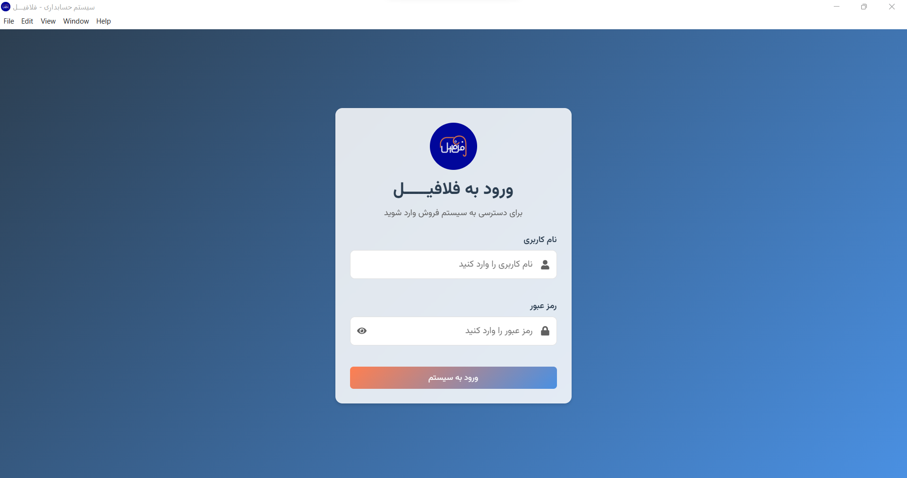
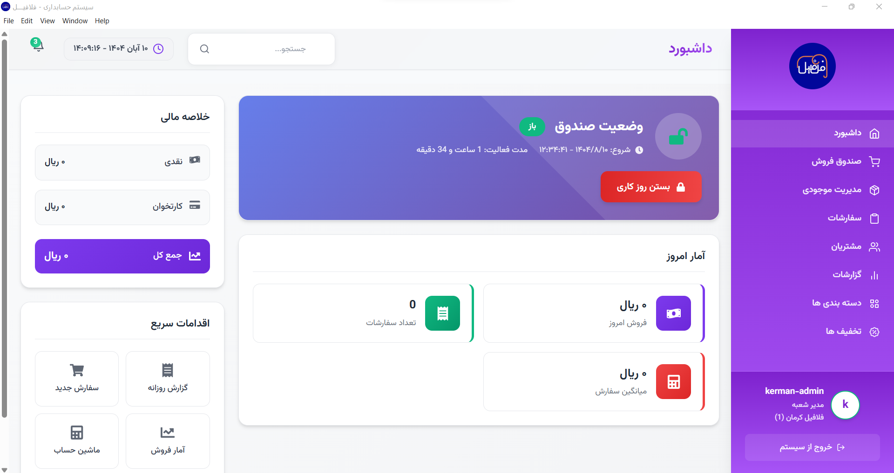
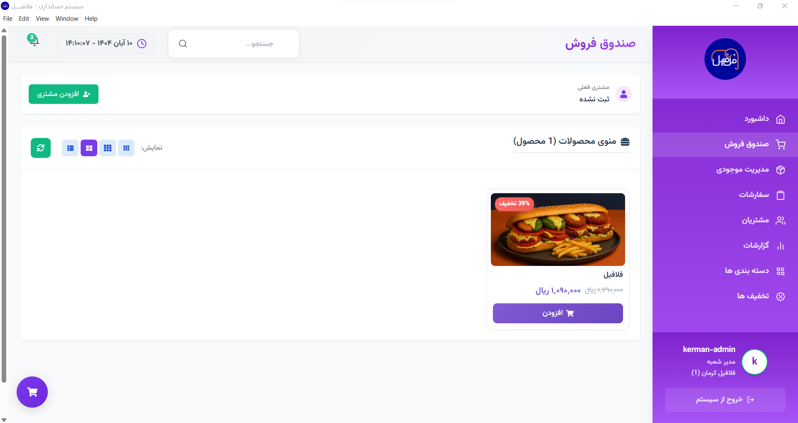
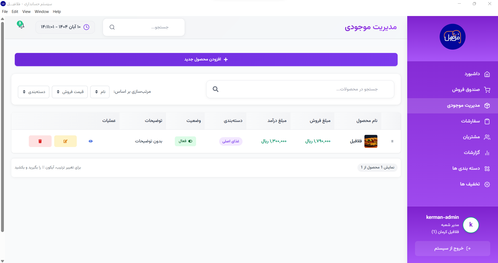

# Advanced Accounting Software for Felafil Restaurants

🌐 [Felafil Website](https://felafil.ir) | 📧 [Contact Us](mailto:info@felafil.ir)

---

## 📋 Table of Contents

- [Project Overview](#-project-overview)
- [Key Features](#-key-features)
- [Project Structure](#-project-structure)
- [System Screenshots](#-system-screenshots)
- [User Roles](#-user-roles)
- [Technology Stack](#-technology-stack)
- [Installation](#-installation)
- [Security & Privacy](#-security--privacy)

---

## 🎯 Project Overview

**Felafil Accounting System** is a **desktop application** built with **Electron + React** specifically designed for the needs of the **Felafil restaurant chain**. This system provides complete management of sales processes, inventory, customers, and reporting.

---

## ✨ Key Features

| Feature                               | Description                                                                               |
| ------------------------------------- | ----------------------------------------------------------------------------------------- |
| 🏪 **Multi-Branch Management**        | Support for multiple branches, user management per branch, separate reporting             |
| 👥 **Advanced Authentication System** | Three access levels, user role management, high security login                            |
| 🛍️ **Sales & POS Management**         | Fast checkout, multiple payment methods, discount/campaign support, auto invoice printing |
| 📊 **Inventory & Product Management** | Product categorization, price/cost management, real-time stock tracking                   |
| 👥 **Customer Management**            | Customer registration, purchase history, loyalty system                                   |
| 📈 **Reports & Analytics**            | Detailed financial and sales reports per branch/user                                      |

---

## 🏗️ Project Structure

### Application Routes Map

/dashboard
├── /main          # Main Dashboard (Managers)
├── /cashier       # POS Interface (All Roles)
├── /inventory     # Inventory Management
├── /customers     # Customer Management
├── /transactions  # Invoice Management
├── /reports       # Reporting & Statistics
├── /categories    # Product Categories
├── /discounts     # Discount Management
├── /users         # User Management (Super Admin Only)
├── /payments      # Payment Methods (Super Admin Only)
└── /printers      # Printer Management (Super Admin Only)

---

## 🖼️ System Screenshots

| Screen                  | Preview                                     |
| ----------------------- | ------------------------------------------- |
| **Login Page**          |              |
| **Main Dashboard**      |      |
| **POS Interface**       |          |
| **Product Management**  |  |

---

## 👨‍💼 User Roles

| Role                  | Permissions                                               |
| --------------------- | --------------------------------------------------------- |
| **1. Super Admin**    | Full access, user/branch management, system configuration |
| **2. Branch Manager** | Product/customer management, reports, discount control    |
| **3. Cashier**        | POS access, sales registration, inventory viewing         |

---

## 🛠️ Technology Stack

### **Frontend**

- **Electron** – Desktop Framework
- **React 18** – UI Library
- **React Router** – Route Management
- **CSS3** – Styling

### **Backend**

- **Node.js** – Runtime Environment
- **SQLite** – Lightweight Database
- **REST API** – Internal Communication

### **Security**

- Multi-level authentication
- Session management
- Role-based route protection
- Password encryption

---

## 🔒 Security & Privacy

This system is developed with **high security standards** and includes:

- Secure user data storage
- Password encryption (bcrypt)
- Access level management
- SQL injection protection
- Session timeout & token validation

---

**Developed for** 🍔 **Felafil Restaurant Chain**

🌐 [felafil.ir](https://felafil.ir) 

